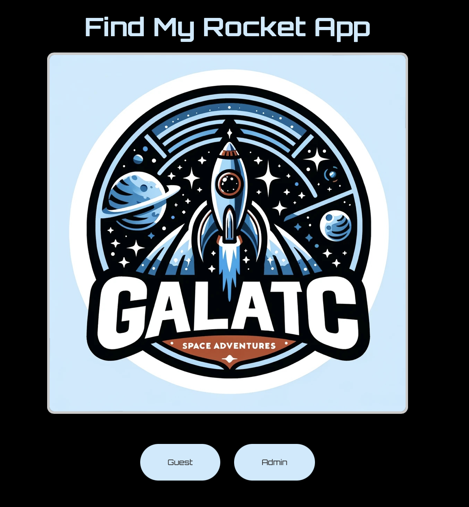

# FindMyRocket Web Application

## Introduction

Welcome to the GitHub repository for FindMyRocket, an innovative web application developed by Galactic Space Adventures' technology team, under the leadership of our visionary CEO, Elara Vexx. FindMyRocket is designed to revolutionize access to space, making it affordable and accessible through a user-friendly online platform.

## Features

FindMyRocket offers a variety of features aimed at simplifying and enhancing the space travel experience:

- **User Authentication:** Secure login system and administrative access for platform management.
- **Subscription Services:** Easy sign-up for updates on discounted space travel, lunar exploration packages, and zero-gravity entertainment.
- **Admin Portal:** Enables administrators to manage user accounts and service updates efficiently, ensuring a seamless experience for all users.
- **Diagnostics Page:** Provides insights into the application's operational status, accessible exclusively by authenticated administrators.
- **Guest Access:** Allows guests to interact with a personalized template, highlighting our commitment to engaging every space enthusiast.
- **Service Updates:** Enables administrators to update services directly through the platform, maintaining high levels of service quality and innovation.

## Benefits

Galactic Space Adventures is dedicated to making space travel both affordable and accessible. The FindMyRocket web application embodies this mission by:

- Centralizing all space travel-related services and information.
- Offering exclusive discounts on space travel and entertainment.
- Providing the latest space research and exploration opportunities.
- Facilitating intergalactic deliveries and lunar exploration.

## Innovations

FindMyRocket stands at the forefront of technological innovation, featuring:

- A secure, hex-based authentication system for improved security.
- Dynamic content generation for guest users, offering a personalized browsing experience.
- Automated service deployment and diagnostics to ensure our offerings are continuously updated and operational.

## Call to Action

We are thrilled to share FindMyRocket with the Galactic Space Adventures community and the world. We invite developers, space enthusiasts, and dreamers to review our application and contribute to its development. Your pull requests are highly encouraged as we aim to broaden the horizons of affordable space travel.

Join us on this historic journey. Together, we can make space travel achievable for everyone.

## Building

You can build with 

``docker build -t gsa-webapp .`` 

Further, it requires tcp ports ``5000`` (webapp) and ``3000`` (service) to be running.

So you can start it with something like the following depending on your local port availability.

``docker run -p3000:3000 -p5000:5000 gsa-webapp`` 

